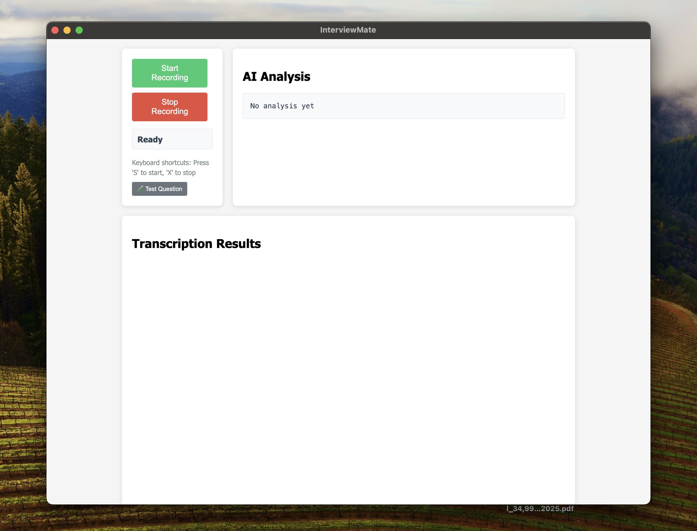
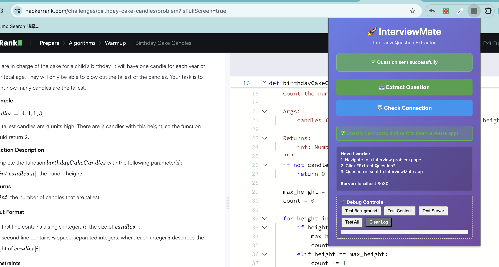

# InterviewMate

An Electron application that provides real-time audio transcription using OpenAI's Whisper model and AI-powered conversation analysis using Qwen 3-Max.

## Screenshots




## Features

- Real-time audio recording and transcription
- Automatic pause detection for AI analysis
- Scrollable transcription history
- Keyboard shortcuts (S to start, X to stop)
- Responsive UI with controls and analysis side-by-side
- Performance metrics tracking (View → Performance Metrics)
- Hot reloading in development mode
- ESLint integration for code quality

## Prerequisites

- Node.js (v14 or higher)
- npm
- A DashScope API key for AI analysis

## Setup

1. Clone the repository and navigate to the project directory.

2. Install dependencies:

   ```
   npm install
   ```

3. Download the Whisper model:

   ```
   npx whisper-node download
   ```

   This downloads the required Whisper model files for offline transcription.

4. Create a `.env` file in the root directory with your DashScope API key:

   ```
   DASHSCOPE_API_KEY=your_api_key_here
   ```

   You can obtain an API key from [DashScope](https://dashscope.aliyun.com/).

5. Start the application:
   ```
   npm start
   ```

## Usage

- Click "Start Recording" or press 'S' to begin recording.
- Speak into your microphone.
- The app will transcribe your speech in real-time.
- After a pause (4 seconds), it will send the conversation to AI for analysis.
- Click "Stop Recording" or press 'X' to stop.
- View transcription history in the scrollable bottom section.

## Architecture

- **Frontend**: React components for UI
- **Audio Processing**: Web Audio API with ScriptProcessorNode
- **Transcription**: OpenAI Whisper via whisper-node
- **AI Analysis**: Qwen 3-Max via DashScope API
- **IPC**: Electron for secure main/renderer communication

## Development

### Available Scripts

- `npm start`: Start the application in production mode
- `npm run dev`: Start the application in development mode with hot reloading
- `npm run lint`: Run ESLint to check for code issues
- `npm run lint:fix`: Run ESLint and automatically fix fixable issues

### Project Structure

- `src/`: React components and utilities
- `main.js`: Electron main process
- `preload.js`: IPC bridge
- `index.html`: Main UI template

### Code Quality

This project uses ESLint to maintain code quality and catch potential issues during development. The linter is configured to handle:

- **Main Process**: Node.js environment rules for Electron main process
- **Renderer Process**: React and browser environment rules
- **ES6 Modules**: Modern JavaScript import/export syntax
- **React Hooks**: Proper usage of React hooks

Run `npm run lint` before committing to ensure code quality.

## Troubleshooting

- Ensure microphone permissions are granted.
- Check that the API key is correctly set in `.env`.
- For audio issues, verify Web Audio API support in your browser.
